# 🏗️ Arquitectura del Sistema
## Walgreens Offers Explorer

Este documento describe la arquitectura técnica completa del sistema Walgreens Offers Explorer, incluyendo componentes, patrones de diseño, flujos de datos y decisiones arquitectónicas.

---

## 📋 Tabla de Contenido

1. [Visión General](#visión-general)
2. [Arquitectura de Alto Nivel](#arquitectura-de-alto-nivel)
3. [Frontend (Cliente)](#frontend-cliente)
4. [Backend (Servidor)](#backend-servidor)
5. [Base de Datos](#base-de-datos)
6. [APIs y Servicios Externos](#apis-y-servicios-externos)
7. [Flujos de Datos](#flujos-de-datos)
8. [Patrones de Diseño](#patrones-de-diseño)
9. [Seguridad](#seguridad)
10. [Performance y Escalabilidad](#performance-y-escalabilidad)
11. [Monitoreo y Logging](#monitoreo-y-logging)

---

## 🔍 Visión General

### Propósito del Sistema
Walgreens Offers Explorer es una aplicación web full-stack diseñada para automatizar y optimizar la gestión de ofertas digitales de Walgreens, proporcionando capacidades de procesamiento masivo, análisis en tiempo real y administración centralizada.

### Principios Arquitectónicos
1. **Separation of Concerns**: Frontend y backend claramente separados
2. **Type Safety**: TypeScript en toda la aplicación
3. **Performance First**: Optimizaciones de cache y procesamiento paralelo
4. **Scalability**: Diseño preparado para crecimiento
5. **Reliability**: Manejo robusto de errores y recuperación automática
6. **Maintainability**: Código limpio y bien documentado

---

## 🏛️ Arquitectura de Alto Nivel

```
┌─────────────────────────────────────────────────────────────┐
│                        CLIENTE                              │
├─────────────────────────────────────────────────────────────┤
│  React 18 + TypeScript + Tailwind CSS + Shadcn UI          │
│  ┌─────────────┐ ┌─────────────┐ ┌─────────────┐          │
│  │  Dashboard  │ │  Control    │ │  Fast       │          │
│  │  Layout     │ │  Panel      │ │  Scanner    │          │
│  └─────────────┘ └─────────────┘ └─────────────┘          │
│                                                             │
│  TanStack Query (Estado) + Wouter (Routing)                │
└─────────────────────────────────────────────────────────────┘
                              │
                        HTTP/WebSocket
                              │
┌─────────────────────────────────────────────────────────────┐
│                       SERVIDOR                              │
├─────────────────────────────────────────────────────────────┤
│  Node.js + Express + TypeScript                             │
│  ┌─────────────┐ ┌─────────────┐ ┌─────────────┐          │
│  │  API Routes │ │  Background │ │  WebSocket  │          │
│  │             │ │  Jobs       │ │  Server     │          │
│  └─────────────┘ └─────────────┘ └─────────────┘          │
│                                                             │
│  ┌─────────────┐ ┌─────────────┐ ┌─────────────┐          │
│  │  Services   │ │  Storage    │ │  Cache      │          │
│  │  Layer      │ │  Layer      │ │  Layer      │          │
│  └─────────────┘ └─────────────┘ └─────────────┘          │
└─────────────────────────────────────────────────────────────┘
                              │
                         SQL/HTTP
                              │
┌─────────────────────────────────────────────────────────────┐
│                    DATOS Y SERVICIOS                        │
├─────────────────────────────────────────────────────────────┤
│  PostgreSQL + Drizzle ORM                                   │
│  ┌─────────────┐ ┌─────────────┐ ┌─────────────┐          │
│  │  Member     │ │  Offers     │ │  Background │          │
│  │  Data       │ │  Data       │ │  Jobs       │          │
│  └─────────────┘ └─────────────┘ └─────────────┘          │
│                                                             │
│  Walgreens APIs (Member, Offers, Store, Balance Rewards)   │
└─────────────────────────────────────────────────────────────┘
```

---

## 💻 Frontend (Cliente)

### Stack Tecnológico
- **Framework**: React 18 con TypeScript
- **Styling**: Tailwind CSS + Shadcn UI + Radix UI
- **Estado**: TanStack React Query v5
- **Routing**: Wouter (client-side routing)
- **Build**: Vite con plugins optimizados
- **Forms**: React Hook Form + Zod validation

### Estructura de Componentes

```
client/src/
├── components/           # Componentes reutilizables
│   ├── ui/              # Componentes base (Shadcn)
│   ├── control-panel.tsx    # Panel de administración
│   ├── dashboard-layout.tsx # Layout principal
│   ├── background-scanner-terminal.tsx # Fast Scanner UI
│   ├── barcode-scanner.tsx  # Scanner de códigos de barras
│   └── api-data-display.tsx # Visualización de datos de API
├── hooks/               # Custom hooks
│   ├── use-mobile.tsx   # Hook para detección móvil
│   ├── use-toast.ts     # Hook para notificaciones
│   └── useBackgroundJobs.ts # Hook para jobs en background
├── lib/                 # Utilidades y configuración
│   ├── api.ts          # Cliente HTTP configurado
│   ├── queryClient.ts  # Configuración de TanStack Query
│   └── utils.ts        # Utilidades generales
├── pages/              # Páginas principales
│   ├── dashboard.tsx   # Dashboard principal
│   ├── home.tsx        # Página de inicio
│   └── not-found.tsx   # Página 404
└── App.tsx            # Componente raíz con routing
```

### Gestión de Estado

**TanStack React Query v5:**
```typescript
// Ejemplo de query configurada
const { data: sidebarCounters, isLoading } = useQuery({
  queryKey: ['/api/member-history/sidebar-counters'],
  staleTime: 30 * 1000, // 30 segundos cache
  refetchInterval: 30 * 1000, // Actualización automática
});

// Ejemplo de mutación
const markAsUsedMutation = useMutation({
  mutationFn: (data) => apiRequest('/api/member-history/mark-as-used', {
    method: 'POST',
    body: JSON.stringify(data)
  }),
  onSuccess: () => {
    // Invalidar cache relacionado
    queryClient.invalidateQueries({ queryKey: ['/api/member-history'] });
  }
});
```

### Responsive Design

**Mobile-First Approach:**
```css
/* Tailwind CSS classes para responsive */
.dashboard-container {
  @apply 
    grid grid-cols-1           /* Móvil: 1 columna */
    md:grid-cols-4            /* Tablet: 4 columnas */
    lg:grid-cols-6            /* Desktop: 6 columnas */
    gap-4 p-4;
}
```

### Componentes Clave

#### Control Panel
- **Responsabilidad**: Administración central del sistema
- **Features**: Lookup, Fast Scanner, configuración
- **Estado**: Gestión local + queries compartidas

#### Dashboard Layout
- **Responsabilidad**: Layout principal responsivo
- **Features**: Sidebar navegable, área de contenido principal
- **Patrones**: Compound Component pattern

#### Background Scanner Terminal
- **Responsabilidad**: Interfaz para Fast Scanner
- **Features**: Progreso en tiempo real, logs de actividad
- **Comunicación**: WebSockets para updates en vivo

---

## 🖥️ Backend (Servidor)

### Stack Tecnológico
- **Runtime**: Node.js 18+ con ES Modules
- **Framework**: Express.js con TypeScript
- **ORM**: Drizzle ORM para type-safe database operations
- **WebSockets**: ws library para comunicación en tiempo real
- **HTTP Client**: node-fetch para APIs externas

### Estructura del Servidor

```
server/
├── services/            # Servicios de negocio
│   ├── walgreens.ts    # Cliente principal de Walgreens API
│   ├── fast-scanner.ts # Lógica de Fast Scanner
│   ├── balance-rewards.ts # Balance Rewards API
│   ├── coupon-analyzer.ts # Análisis de cupones con AI
│   └── deal-optimizer.ts  # Optimización de ofertas
├── routes.ts           # Definición de rutas de API
├── storage.ts          # Capa de abstracción de datos
├── background-jobs.ts  # Sistema de trabajos en segundo plano
├── db.ts              # Configuración de base de datos
├── vite.ts            # Configuración de Vite para desarrollo
└── index.ts           # Punto de entrada del servidor
```

### Arquitectura de Capas

#### 1. API Layer (routes.ts)
```typescript
// Ejemplo de ruta con validación
app.get('/api/member-history/accounts-100-plus', async (req, res) => {
  try {
    const accounts = await storage.getMembersByBalance(100);
    res.json(accounts);
  } catch (error) {
    res.status(500).json({ error: error.message });
  }
});
```

#### 2. Service Layer (services/)
```typescript
// Ejemplo de servicio con rate limiting
class WalgreensAPIService {
  private apiKeys: APIKey[];
  private currentKeyIndex = 0;
  
  async getMemberProfile(phone: string): Promise<MemberProfile> {
    const apiKey = this.getNextAPIKey();
    const response = await this.makeRequest('/api/v3/members/profile', {
      apiKey: apiKey.key,
      phone
    });
    return response.data;
  }
  
  private getNextAPIKey(): APIKey {
    // Round-robin rotation de API keys
    const key = this.apiKeys[this.currentKeyIndex];
    this.currentKeyIndex = (this.currentKeyIndex + 1) % this.apiKeys.length;
    return key;
  }
}
```

#### 3. Storage Layer (storage.ts)
```typescript
interface IStorage {
  // Member operations
  getMemberHistory(options: PaginationOptions): Promise<MemberHistoryRecord[]>;
  addMemberHistory(member: MemberHistoryInsert): Promise<MemberHistoryRecord>;
  markMemberAsUsed(id: number): Promise<void>;
  
  // Background job operations
  createBulkVerificationJob(phoneNumbers: string[]): Promise<BulkVerificationJob>;
  updateJobProgress(jobId: string, progress: number): Promise<void>;
}

class DatabaseStorage implements IStorage {
  // Implementación con Drizzle ORM
}
```

### Background Jobs System

**Arquitectura de Jobs:**
```typescript
class BackgroundJobManager {
  private jobs = new Map<string, BackgroundJob>();
  
  async startBulkVerification(phoneNumbers: string[]): Promise<string> {
    const jobId = generateJobId();
    const job = new BulkVerificationJob(jobId, phoneNumbers);
    
    this.jobs.set(jobId, job);
    
    // Procesar en paralelo con rate limiting
    job.start();
    
    return jobId;
  }
  
  getJobStatus(jobId: string): JobStatus {
    return this.jobs.get(jobId)?.getStatus();
  }
}
```

### WebSocket Server

**Real-time Updates:**
```typescript
const wss = new WebSocketServer({ port: 8080 });

wss.on('connection', (ws) => {
  // Suscribir a updates de jobs
  const unsubscribe = jobManager.subscribe((update) => {
    ws.send(JSON.stringify({
      type: 'job_update',
      data: update
    }));
  });
  
  ws.on('close', unsubscribe);
});
```

---

## 🗄️ Base de Datos

### Esquema de Datos (PostgreSQL + Drizzle)

#### Tablas Principales

**Members:**
```typescript
export const members = pgTable("members", {
  id: serial("id").primaryKey(),
  phoneNumber: text("phone_number").notNull().unique(),
  assignedStoreNumber: text("assigned_store_number"),
  assignedStoreName: text("assigned_store_name"),
  assignedStoreAddress: json("assigned_store_address"),
  createdAt: timestamp("created_at").defaultNow(),
});
```

**Member History (Principal):**
```typescript
export const memberHistory = pgTable("member_history", {
  id: serial("id").primaryKey(),
  phoneNumber: text("phone_number").notNull(),
  encLoyaltyId: text("enc_loyalty_id").notNull(),
  memberName: text("member_name"),
  cardNumber: text("card_number"),
  currentBalance: integer("current_balance"),
  currentBalanceDollars: text("current_balance_dollars"),
  lastActivityDate: text("last_activity_date"),
  emailAddress: text("email_address"),
  memberData: json("member_data"), // Datos completos de la API
  lastAccessedAt: timestamp("last_accessed_at").defaultNow(),
  createdAt: timestamp("created_at").defaultNow(),
  markedAsUsed: boolean("marked_as_used").default(false),
  markedAsUsedAt: timestamp("marked_as_used_at"),
});
```

**Offers Management:**
```typescript
export const offers = pgTable("offers", {
  id: serial("id").primaryKey(),
  offerId: text("offer_id").notNull().unique(),
  title: text("title").notNull(),
  description: text("description"),
  discount: text("discount"),
  category: text("category"),
  imageUrl: text("image_url"),
  expiryDate: text("expiry_date"),
  status: text("status").default("active"),
  offerData: json("offer_data"), // Datos completos de la oferta
  createdAt: timestamp("created_at").defaultNow(),
});

export const clippedOffers = pgTable("clipped_offers", {
  id: serial("id").primaryKey(),
  encLoyaltyId: text("enc_loyalty_id").notNull(),
  offerId: text("offer_id").notNull(),
  channel: text("channel").default("web"),
  status: text("status").default("active"),
  clippedAt: timestamp("clipped_at").defaultNow(),
});
```

**Background Jobs:**
```typescript
export const bulkVerificationJobs = pgTable("bulk_verification_jobs", {
  id: serial("id").primaryKey(),
  jobId: varchar("job_id", { length: 255 }).notNull().unique(),
  status: text("status").default("pending"), // pending, running, completed, failed
  totalPhoneNumbers: integer("total_phone_numbers"),
  processedCount: integer("processed_count").default(0),
  validCount: integer("valid_count").default(0),
  invalidCount: integer("invalid_count").default(0),
  progress: integer("progress").default(0), // 0-100
  startedAt: timestamp("started_at"),
  completedAt: timestamp("completed_at"),
  errorMessage: text("error_message"),
  resultsSummary: json("results_summary"),
  createdAt: timestamp("created_at").defaultNow(),
});
```

**API Key Management:**
```typescript
export const apiKeys = pgTable("api_keys", {
  id: serial("id").primaryKey(),
  name: text("name").notNull(),
  apiKey: text("api_key").notNull(),
  affId: text("aff_id").notNull(),
  isActive: boolean("is_active").default(true),
  requestCount: integer("request_count").default(0),
  lastUsedAt: timestamp("last_used_at"),
  createdAt: timestamp("created_at").defaultNow(),
});
```

### Índices y Performance

**Índices Críticos:**
```sql
-- Índices para búsquedas rápidas
CREATE INDEX idx_member_history_phone ON member_history(phone_number);
CREATE INDEX idx_member_history_balance ON member_history(current_balance);
CREATE INDEX idx_member_history_marked ON member_history(marked_as_used);
CREATE INDEX idx_member_history_activity ON member_history(last_activity_date);

-- Índices compuestos para queries complejas
CREATE INDEX idx_member_history_balance_marked ON member_history(current_balance, marked_as_used);
CREATE INDEX idx_offers_status_expiry ON offers(status, expiry_date);
```

### Migración y Versionado

**Drizzle Schema Management:**
```bash
# Aplicar cambios de esquema
npm run db:push

# Generar migraciones (si es necesario)
npx drizzle-kit generate:pg

# Aplicar migraciones
npx drizzle-kit push:pg
```

---

## 🌐 APIs y Servicios Externos

### Walgreens API Integration

#### API Keys Management
```typescript
interface APIKeyConfig {
  name: string;
  apiKey: string;
  affId: string;
  isActive: boolean;
  requestCount: number;
  lastUsedAt: Date;
}

class APIKeyPool {
  private keys: APIKeyConfig[];
  private rateLimiter: RateLimiter;
  
  constructor(keys: APIKeyConfig[]) {
    this.keys = keys.filter(k => k.isActive);
    this.rateLimiter = new RateLimiter(300, 60000); // 300 req/min per key
  }
  
  async getAvailableKey(): Promise<APIKeyConfig> {
    // Round-robin con rate limiting
    for (const key of this.keys) {
      if (await this.rateLimiter.canMakeRequest(key.apiKey)) {
        return key;
      }
    }
    throw new Error('No available API keys');
  }
}
```

#### Endpoints Integrados

**Member API:**
- `GET /api/v3/members/profile` - Perfil de miembro
- `GET /api/v3/members/rewards` - Recompensas
- `GET /api/v3/members/preferences` - Preferencias

**Offers API:**
- `GET /api/v3/offers/available` - Ofertas disponibles
- `POST /api/v3/offers/clip` - Clipear oferta
- `GET /api/v3/offers/clipped` - Ofertas clipeadas
- `GET /api/v3/offers/redeemed` - Ofertas canjeadas

**Store Locator API:**
- `GET /api/v3/stores` - Búsqueda de tiendas
- `GET /api/v3/stores/{storeId}` - Detalles de tienda

### Error Handling y Retry Logic

```typescript
class WalgreensAPIClient {
  async makeRequest(endpoint: string, options: RequestOptions): Promise<any> {
    const maxRetries = 3;
    let attempt = 0;
    
    while (attempt < maxRetries) {
      try {
        const apiKey = await this.keyPool.getAvailableKey();
        const response = await fetch(`${BASE_URL}${endpoint}`, {
          ...options,
          headers: {
            'apikey': apiKey.apiKey,
            'Content-Type': 'application/json',
            ...options.headers
          }
        });
        
        if (!response.ok) {
          throw new APIError(response.status, await response.text());
        }
        
        return await response.json();
        
      } catch (error) {
        attempt++;
        if (attempt >= maxRetries) throw error;
        
        // Exponential backoff
        await this.delay(Math.pow(2, attempt) * 1000);
      }
    }
  }
}
```

---

## 🔄 Flujos de Datos

### Fast Scanner Flow

```mermaid
graph TD
    A[Usuario inicia Fast Scanner] --> B[Cargar números de teléfono]
    B --> C[Crear Background Job]
    C --> D[Dividir en batches de 20]
    D --> E[Procesar batch en paralelo]
    E --> F[Rotar API Keys]
    F --> G[Llamar Walgreens API]
    G --> H{API Response OK?}
    H -->|Sí| I[Guardar en BD]
    H -->|No| J[Log error y continuar]
    I --> K[Actualizar progreso]
    J --> K
    K --> L{Más batches?}
    L -->|Sí| E
    L -->|No| M[Completar Job]
    M --> N[Notificar vía WebSocket]
    N --> O[Actualizar UI]
```



### Real-time Updates Flow


### Cache Invalidation Flow

```typescript
// Cache strategy con TTL y invalidación inteligente
class CacheManager {
  private cache = new Map<string, CacheEntry>();
  
  async get(key: string, fetcher: () => Promise<any>, ttl: number): Promise<any> {
    const entry = this.cache.get(key);
    
    if (entry && !this.isExpired(entry, ttl)) {
      return entry.data;
    }
    
    const data = await fetcher();
    this.cache.set(key, { data, timestamp: Date.now() });
    return data;
  }
  
  invalidatePattern(pattern: string): void {
    // Invalidar múltiples keys que coincidan con el patrón
    for (const [key] of this.cache) {
      if (key.includes(pattern)) {
        this.cache.delete(key);
      }
    }
  }
}
```

---

## 🎨 Patrones de Diseño

### Frontend Patterns

#### 1. Compound Component Pattern
```typescript
// Dashboard Layout con subcomponentes
const DashboardLayout = ({ children }) => {
  return (
    <div className="dashboard-container">
      {children}
    </div>
  );
};

DashboardLayout.Sidebar = Sidebar;
DashboardLayout.Content = Content;
DashboardLayout.Header = Header;

// Uso
<DashboardLayout>
  <DashboardLayout.Sidebar />
  <DashboardLayout.Content>
    {/* contenido */}
  </DashboardLayout.Content>
</DashboardLayout>
```

#### 2. Custom Hooks Pattern
```typescript
// Hook para gestión de background jobs
const useBackgroundJobs = () => {
  const [jobs, setJobs] = useState<Job[]>([]);
  const [activeJob, setActiveJob] = useState<Job | null>(null);
  
  const startJob = useCallback(async (config: JobConfig) => {
    const response = await apiRequest('/api/jobs/start', {
      method: 'POST',
      body: JSON.stringify(config)
    });
    
    const job = response.data;
    setJobs(prev => [...prev, job]);
    setActiveJob(job);
    
    return job;
  }, []);
  
  return { jobs, activeJob, startJob };
};
```

### Backend Patterns

#### 1. Repository Pattern
```typescript
interface MemberRepository {
  findByPhone(phone: string): Promise<Member | null>;
  findByBalance(minBalance: number): Promise<Member[]>;
  save(member: Member): Promise<Member>;
  markAsUsed(id: number): Promise<void>;
}

class DatabaseMemberRepository implements MemberRepository {
  constructor(private db: Database) {}
  
  async findByPhone(phone: string): Promise<Member | null> {
    const result = await this.db
      .select()
      .from(memberHistory)
      .where(eq(memberHistory.phoneNumber, phone))
      .limit(1);
      
    return result[0] || null;
  }
}
```

#### 2. Service Layer Pattern
```typescript
class MemberService {
  constructor(
    private memberRepo: MemberRepository,
    private walgreensAPI: WalgreensAPIService,
    private cache: CacheManager
  ) {}
  
  async getMemberProfile(phone: string): Promise<MemberProfile> {
    // Check cache first
    const cached = await this.cache.get(`member:${phone}`);
    if (cached) return cached;
    
    // Check database
    let member = await this.memberRepo.findByPhone(phone);
    
    if (!member || this.isStale(member)) {
      // Fetch from API
      const apiData = await this.walgreensAPI.getMemberProfile(phone);
      member = await this.memberRepo.save(apiData);
    }
    
    // Cache result
    await this.cache.set(`member:${phone}`, member, 300); // 5 min TTL
    
    return member;
  }
}
```

#### 3. Command Pattern (Background Jobs)
```typescript
interface Command {
  execute(): Promise<void>;
  undo(): Promise<void>;
}

class BulkVerificationCommand implements Command {
  constructor(
    private phoneNumbers: string[],
    private jobId: string,
    private apiService: WalgreensAPIService
  ) {}
  
  async execute(): Promise<void> {
    const batches = this.createBatches(this.phoneNumbers, 20);
    
    for (const batch of batches) {
      await this.processBatch(batch);
      await this.updateProgress();
    }
  }
  
  async undo(): Promise<void> {
    // Rollback logic if needed
  }
}
```

---

## 🔒 Seguridad

### Authentication & Authorization
```typescript
// Middleware de autenticación (si se implementa)
const authenticateToken = (req: Request, res: Response, next: NextFunction) => {
  const authHeader = req.headers['authorization'];
  const token = authHeader && authHeader.split(' ')[1];
  
  if (!token) {
    return res.sendStatus(401);
  }
  
  jwt.verify(token, process.env.JWT_SECRET!, (err, user) => {
    if (err) return res.sendStatus(403);
    req.user = user;
    next();
  });
};
```

### Input Validation
```typescript
// Validación con Zod
const memberLookupSchema = z.object({
  phoneNumber: z.string()
    .regex(/^\d{10}$/, 'Phone number must be 10 digits')
    .transform(phone => phone.replace(/\D/g, '')),
});

app.post('/api/members/lookup', async (req, res) => {
  try {
    const { phoneNumber } = memberLookupSchema.parse(req.body);
    // Proceso seguro...
  } catch (error) {
    res.status(400).json({ error: 'Invalid input' });
  }
});
```

### Rate Limiting
```typescript
const rateLimiter = rateLimit({
  windowMs: 15 * 60 * 1000, // 15 minutes
  max: 100, // Limit each IP to 100 requests per windowMs
  message: 'Too many requests from this IP',
  standardHeaders: true,
  legacyHeaders: false,
});

app.use('/api/', rateLimiter);
```

### Environment Variables Security
```typescript
// Validación de variables de entorno al inicio
const requiredEnvVars = [
  'DATABASE_URL',
  'WALGREENS_API_KEY',
  'WALGREENS_AFF_ID'
];

for (const envVar of requiredEnvVars) {
  if (!process.env[envVar]) {
    throw new Error(`Missing required environment variable: ${envVar}`);
  }
}
```

---

## ⚡ Performance y Escalabilidad

### Database Optimization

#### Connection Pooling
```typescript
// Configuración optimizada de Neon serverless
const pool = new Pool({
  connectionString: process.env.DATABASE_URL,
  max: 20, // Maximum connections
  idleTimeoutMillis: 30000,
  connectionTimeoutMillis: 2000,
});
```

#### Query Optimization
```typescript
// Queries optimizadas con índices
const getAccountsByBalance = async (minBalance: number, limit = 50) => {
  return await db
    .select({
      id: memberHistory.id,
      phoneNumber: memberHistory.phoneNumber,
      memberName: memberHistory.memberName,
      currentBalance: memberHistory.currentBalance,
      lastActivityDate: memberHistory.lastActivityDate,
    })
    .from(memberHistory)
    .where(
      and(
        gte(memberHistory.currentBalance, minBalance),
        eq(memberHistory.markedAsUsed, false)
      )
    )
    .orderBy(desc(memberHistory.currentBalance))
    .limit(limit);
};
```

### Caching Strategy

#### Multi-Level Cache
```typescript
class MultiLevelCache {
  private memoryCache = new Map<string, any>();
  private redisCache?: Redis; // Si se implementa Redis
  
  async get(key: string): Promise<any> {
    // L1: Memory cache
    if (this.memoryCache.has(key)) {
      return this.memoryCache.get(key);
    }
    
    // L2: Redis cache (si disponible)
    if (this.redisCache) {
      const value = await this.redisCache.get(key);
      if (value) {
        this.memoryCache.set(key, JSON.parse(value));
        return JSON.parse(value);
      }
    }
    
    return null;
  }
  
  async set(key: string, value: any, ttl: number): Promise<void> {
    // Set in both levels
    this.memoryCache.set(key, value);
    
    if (this.redisCache) {
      await this.redisCache.setex(key, ttl, JSON.stringify(value));
    }
    
    // Memory cache cleanup after TTL
    setTimeout(() => this.memoryCache.delete(key), ttl * 1000);
  }
}
```

### Horizontal Scaling

#### Cluster Mode
```typescript
// ecosystem.config.js para PM2
module.exports = {
  apps: [{
    name: 'walgreens-offers-explorer',
    script: 'dist/index.js',
    instances: 'max', // Usa todos los CPU cores disponibles
    exec_mode: 'cluster',
    env: {
      NODE_ENV: 'production'
    }
  }]
};
```

#### Load Balancing
```nginx
# Nginx load balancer configuration
upstream walgreens_app {
    least_conn;
    server 127.0.0.1:5000;
    server 127.0.0.1:5001;
    server 127.0.0.1:5002;
    server 127.0.0.1:5003;
}

server {
    listen 80;
    location / {
        proxy_pass http://walgreens_app;
    }
}
```

---

## 📊 Monitoreo y Logging

### Structured Logging
```typescript
class Logger {
  static info(message: string, meta?: any) {
    console.log(JSON.stringify({
      level: 'info',
      message,
      meta,
      timestamp: new Date().toISOString(),
      service: 'walgreens-offers-explorer'
    }));
  }
  
  static error(message: string, error?: Error, meta?: any) {
    console.error(JSON.stringify({
      level: 'error',
      message,
      error: error?.stack,
      meta,
      timestamp: new Date().toISOString(),
      service: 'walgreens-offers-explorer'
    }));
  }
}
```

### Health Checks
```typescript
app.get('/health', (req, res) => {
  const health = {
    status: 'OK',
    timestamp: new Date().toISOString(),
    uptime: process.uptime(),
    memory: process.memoryUsage(),
    database: 'connected', // Check DB connection
    apis: {
      walgreens: 'operational' // Check external APIs
    }
  };
  
  res.json(health);
});
```

### Metrics Collection
```typescript
class MetricsCollector {
  private static metrics = new Map<string, number>();
  
  static increment(metric: string, value = 1) {
    const current = this.metrics.get(metric) || 0;
    this.metrics.set(metric, current + value);
  }
  
  static gauge(metric: string, value: number) {
    this.metrics.set(metric, value);
  }
  
  static getMetrics() {
    return Object.fromEntries(this.metrics);
  }
}

// Uso en endpoints
app.get('/api/metrics', (req, res) => {
  res.json(MetricsCollector.getMetrics());
});
```

---

## 🔄 Decisiones Arquitectónicas

### ¿Por qué estas tecnologías?

#### TypeScript en todo el stack
- **Beneficio**: Type safety, mejor DX, menos bugs en runtime
- **Trade-off**: Overhead de compilación, curva de aprendizaje

#### TanStack Query sobre Redux
- **Beneficio**: Optimizado para server state, cache automático, menos boilerplate
- **Trade-off**: Menos control granular sobre estado local

#### Drizzle ORM sobre Prisma
- **Beneficio**: Type-safe, lightweight, SQL-like syntax
- **Trade-off**: Menor ecosistema, menos features avanzadas

#### Express sobre Fastify/Koa
- **Beneficio**: Ecosistema maduro, simplicidad, amplia adopción
- **Trade-off**: Menor performance que alternativas más modernas

#### PostgreSQL sobre MongoDB
- **Beneficio**: ACID compliance, relaciones complejas, SQL estándar
- **Trade-off**: Menos flexibilidad para datos no estructurados

### Patterns Elegidos

#### Server-Side State vs Client-Side State
- **Server State**: TanStack Query con cache automático
- **Client State**: React useState para UI state local
- **Persistent State**: sessionStorage para datos temporales

#### Error Boundaries vs Try-Catch Global
- **Frontend**: Error boundaries para captura de errores de componentes
- **Backend**: Error handling middleware centralizado

#### WebSockets vs Server-Sent Events
- **Elección**: WebSockets para comunicación bidireccional
- **Justificación**: Necesidad de enviar comandos desde cliente

---

## 🚀 Roadmap Técnico

### Optimizaciones Futuras

#### Performance
- [ ] Implementar Redis para cache distribuido
- [ ] Optimizar queries con materialized views
- [ ] Implementar CDN para assets estáticos
- [ ] Background job queue con Bull/Agenda

#### Escalabilidad
- [ ] Microservicios para Fast Scanner
- [ ] Database sharding por regiones
- [ ] API Gateway con rate limiting
- [ ] Auto-scaling con Docker Swarm/K8s

#### Seguridad
- [ ] JWT authentication completo
- [ ] API key rotation automática
- [ ] Encryption at rest para datos sensibles
- [ ] Security headers con Helmet.js

#### Monitoring
- [ ] APM con New Relic/DataDog
- [ ] Alerting con PagerDuty
- [ ] Distributed tracing
- [ ] Custom metrics dashboard

---

Esta arquitectura está diseñada para ser robusta, escalable y mantenible, proporcionando una base sólida para el crecimiento futuro del sistema mientras mantiene la simplicidad operacional.